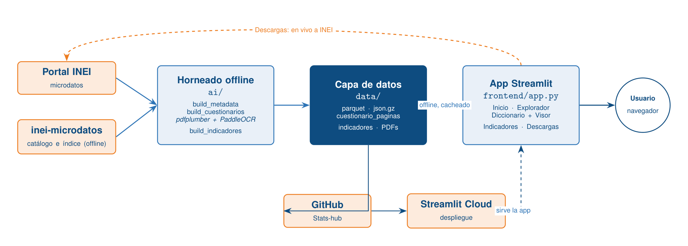

# Stats

**Hacemos utilizable toda la ENAHO para tesistas e investigadores del Perú:** explora
módulos, busca entre más de 70 mil variables, consulta indicadores listos y descarga bases
para Stata, Python o SPSS, con el cuestionario abierto en la página exacta de cada variable.

**Demo en vivo:** <https://stats-demo.streamlit.app/>
**Video demo:** <https://drive.google.com/drive/folders/1G0Dg-dC39yghJznvJY2c1MRXsiuQ_D13?usp=sharing>
(Stats es el nombre del producto; el repositorio se llama ENAHO Hub.)

## Problema
La ENAHO es la principal fuente de pobreza, empleo e ingresos del Perú, pero llega repartida
en decenas de módulos, tres metodologías, varios formatos y casi 30 años, con codificación
incómoda y más de 70 mil variables. Encontrar una variable, saber en qué módulo y año está y
bajar la base correcta toma horas. Y el portal de INEI a veces no responde.

**Validación:** lo confirmamos con investigadores reales de la UP y el CIUP (ver
[`docs/research/entrevistas_validacion.md`](docs/research/entrevistas_validacion.md)): 2 de 2
usan la ENAHO, pierden tiempo en el portal de INEI y pagarían por ahorrarlo.

## Solución
Stats ordena esa data pública y la sirve desde una capa de metadata pre-horneada que
funciona OFFLINE:
- Explorador de módulos con una sinopsis curada de cada uno.
- Diccionario de variables buscable (por nombre o etiqueta) que muestra en qué módulos y
  años aparece cada variable.
- Visor de cuestionario: al elegir una variable se muestra el PDF del cuestionario en la
  página exacta de la pregunta (el diferenciador).
- Indicadores ENAHO 2024 (pobreza, pobreza extrema, ingreso y gasto del hogar) calculados
  desde la Sumaria con el factor de expansión y servidos offline.
- Descargas que bajan la base de INEI en vivo (cacheada) y la entregan lista para Stata,
  SPSS, Python o CSV.
- "Modo institución" que demuestra el esquema de negocio B2B por cuentas (MEF, UP, ULIMA,
  PUCP), sin login real.

El producto no es la data (es pública): es la capa que la ordena y el tiempo que ahorra.

## Mercado y modelo de negocio

En el Perú hay **97 universidades licenciadas** por SUNEDU con **~1.2 millones de estudiantes
matriculados** (SUNEDU, 2023), además de ministerios (MEF, MIDIS), INEI, BCRP, gobiernos
regionales, think tanks (GRADE, IEP, la red CIES) y consultoras. Todos usan la ENAHO como
insumo central y miles de tesis y reportes al año dependen de ella; hoy el descubrimiento de
variables y la descarga se hacen a mano sobre el portal de INEI.

- **TAM** (todo el problema): el universo de usuarios de microdatos ENAHO en el Perú (programas
  de economía, ciencias sociales, salud pública y políticas públicas de las 97 universidades,
  sector público y cooperación). Estimado conservador: **50-80 mil** usuarios potenciales
  (tesistas, docentes-investigadores RENACYT, analistas públicos).
- **SAM** (a quién podemos vender): instituciones que hacen investigación cuantitativa con
  microdatos de hogares de forma recurrente: ~**40-60 departamentos** de economía/ciencias
  sociales con producción académica, más unidades de estudios del sector público y ONGs.
- **SOM** (primeros 12 meses): cabeza de playa en Lima (UP, donde nace el producto, PUCP,
  ULIMA, UNMSM) más 3-5 equipos del sector público/ONG. Meta: **8-15 cuentas institucionales**
  y **~500-1,000 usuarios individuales** (freemium a pago).

**Modelo de negocio (B2B + freemium).** El producto no es la data (es pública y gratuita): es
la capa que la ordena.

| Plan | Precio | Para quién |
|---|---|---|
| **Tesista (Free)** | S/. 0 | Búsqueda de variables, explorador, indicadores y visor de cuestionario. Gancho de adquisición. |
| **Pro (individual)** | **S/. 39 / mes** | Descargas ilimitadas (Stata/SPSS/CSV), exportar gráficos e indicadores a PNG/Excel, multi-año. |
| **Institucional (B2B)** | **desde S/. 8,000 / año** | Cuentas por facultad/departamento (modo institución), asientos múltiples, soporte y paneles. |

**Contribution margin.** El costo variable por usuario es casi nulo: la data es pública, la
metadata está pre-horneada (sin cómputo pesado) y el hosting corre en infraestructura
gratuita/barata (Streamlit Cloud); el único costo marginal es el ancho de banda de las
descargas en vivo desde INEI. Margen de contribución estimado **>90%** (software sobre data
pública).

**Go-to-market.**
- **Primeros 10:** compañeros tesistas y profesores de la UP (founder-market fit), en talleres
  de tesis y cursos de econometría.
- **Primeros 100:** departamentos de economía y ciencias sociales de UP, PUCP, ULIMA y UNMSM;
  asesores de tesis; la red CIES; comunidades de datos del Perú en LinkedIn.
- **Primeros 1,000:** las 97 universidades licenciadas, unidades de estudios del sector público
  (MEF, ministerios, gobiernos regionales) y consultoras; alianzas con bibliotecas
  universitarias y con la comunidad de usuarios de microdatos de INEI.

**Competencia y moat.**

| Alternativa | Limitación |
|---|---|
| Portal de microdatos de INEI | Gratis pero crudo: sin búsqueda de variables, sin sinopsis ni visor de cuestionario. |
| Hacerlo a mano (Excel + descargas) | Horas por variable; propenso a errores; el status quo doloroso. |
| Paquetes/código (`inei-microdatos`, R) | Potentes, pero para programadores, no para tesistas no técnicos. |
| Stata / SPSS | Herramientas de análisis, no de descubrimiento ni de la documentación. |

**Moat:** la capa de metadata curada y, sobre todo, el mapeo **variable → página exacta del
cuestionario** (un dataset propio difícil de replicar), más la marca y la comunidad de usuarios.

**Visión regional.** El modelo se replica en toda LATAM: cada país tiene su encuesta nacional
de hogares, igual de fragmentada (CASEN en Chile, ENIGH en México, GEIH en Colombia, EPH en
Argentina, PNAD en Brasil, ECH en Uruguay). Stats puede ser la capa que ordena los datos
públicos de Latinoamérica.

Fuentes: SUNEDU (universidades licenciadas y matrícula, 2023); RENACYT/CONCYTEC (registro de
investigadores); INEI (ENAHO).

## Alcance de la demo
Esta primera versión es una demo acotada a **ENAHO 2024** para validar el flujo completo de
punta a punta. El mecanismo está parametrizado por año (constante `ANIOS` en los scripts de
`ai/`) y generaliza al resto de años con solo ampliarla y volver a hornear.

## Cómo correr
```bash
pip install -r requirements.txt

# 1. Hornear la metadata offline (genera data/enaho_*.*). No toca la red.
python ai/build_metadata.py

# 2. (Opcional) Mapear variables a la página de su cuestionario. Descarga PDFs de INEI.
python ai/build_cuestionarios.py

# 3. (Opcional) Hornear los indicadores. Descarga la Sumaria una vez.
python ai/build_indicadores.py

# 4. (Opcional) Activar el modo institución copiando el ejemplo de secrets.
cp .streamlit/secrets.toml.example .streamlit/secrets.toml

# 5. Levantar la app.
streamlit run frontend/app.py
```
Con los pasos 1 y 3 la app es totalmente funcional offline. Solo las descargas (y los pasos 2
y 3 de horneado) tocan INEI en vivo.

## Despliegue (demo en vivo)
La app está lista para **Streamlit Community Cloud** (gratis), sin que el evaluador instale ni
clone nada. La metadata, los indicadores y los PDFs del visor están versionados, así que
Inicio, Explorador, Diccionario (con visor de cuestionario) e Indicadores funcionan online sin
tocar la red; solo la pestaña Descargas baja bases de INEI en vivo.

Para publicar:
1. Subir este repositorio a **GitHub público** (rama `main`).
2. En <https://share.streamlit.io> conectar la cuenta de GitHub, elegir el repo y el archivo
   principal `frontend/app.py`, y desplegar.
3. (Opcional) En *Settings → Secrets* pegar el bloque `[instituciones]` de
   `.streamlit/secrets.toml.example` para activar el modo institución.
4. Copiar la URL resultante arriba, en **Demo en vivo**.

## Arquitectura



Principio: la metadata y los indicadores se sirven OFFLINE desde archivos pre-horneados en
`data/`, sin red, para que la demo no dependa de que INEI esté arriba. Solo las descargas
usan el portal en vivo.

- `ai/build_metadata.py` lee el catálogo y el índice de variables empaquetados en
  `inei-microdatos` y hornea `data/enaho_modulos.json.gz`, `data/enaho_variables.parquet` y
  `data/enaho_resumen.json`.
- `ai/sinopsis_modulos.py` resuelve la sinopsis de cada módulo por subcadena de su nombre.
- `ai/build_cuestionarios.py` descarga los cuestionarios, extrae texto por página
  (pdfplumber; pymupdf de respaldo; PaddleOCR opcional para escaneados) y mapea cada variable
  a su página por el número de pregunta, generando `data/cuestionario_paginas.json`.
- `ai/build_indicadores.py` descarga la Sumaria una vez y calcula indicadores ponderados
  (pobreza, ingreso, gasto) por dominio y área, generando `data/indicadores.json`.
- `frontend/app.py` es la app Streamlit con cinco pestañas (Inicio, Explorador, Diccionario,
  Indicadores, Descargas).

Tres colecciones: "ENAHO Metodología Actualizada (2004+)", "ENAHO Metodología Anterior
(1997-2003)" y "ENAHO Panel".

## Estructura de carpetas
```
ai/
  build_metadata.py       hornea la metadata offline
  sinopsis_modulos.py     sinopsis curadas por módulo
  build_cuestionarios.py  mapea variable -> página del cuestionario
  build_indicadores.py    hornea indicadores de pobreza e ingreso (Sumaria)
  comun.py                helpers (codificación, colección, módulo)
frontend/app.py           app Streamlit (5 pestañas)
data/                     metadata pre-horneada (versionada); PDFs/ZIPs fuera de git
.streamlit/               secrets.toml.example (modo institución)
.github/workflows/ci.yml  lint y parse básicos
CLAUDE.md                 objetivo, arquitectura y convenciones del proyecto
```

## Herramientas de IA del curso usadas en el producto
El curso pide usar al menos dos herramientas del semestre y justificar por qué. Stats usa:

1. **Document AI / OCR de PDFs (Lectura 14): `pdfplumber` + `PaddleOCR`.** El visor de
   cuestionario es un pipeline de *document AI*. `ai/build_cuestionarios.py` descarga los PDFs
   de los cuestionarios, **extrae el texto por página con `pdfplumber`** y, si una página
   estuviera escaneada y no diera texto, cae a **`PaddleOCR`** como respaldo (función
   `ocr_imagen`). Con ese texto construye anclas (número de pregunta → página) y mapea cada una
   de las +70 mil variables a la página exacta de su pregunta (`data/cuestionario_paginas.json`).
   Lo elegimos porque los cuestionarios de INEI son PDFs y necesitábamos extraer su estructura,
   justo el caso de uso de la Lectura 14.
2. **Agente de código (Claude Code) como co-founder técnico.** El backend de datos (`ai/`), la
   app (`frontend/app.py`) y la documentación se construyeron con Claude Code bajo mi dirección
   y revisión, iterando el prototipo en días. La rapidez de iteración como solo founder es parte
   de la propuesta del curso.

> Extensión prevista: el visor está listo para sumar un asistente con la **API de Claude**
> (búsqueda de variables en lenguaje natural) sobre la misma metadata offline.

### Autoría y partes asistidas por IA
La construcción de este repositorio fue asistida por Claude Code. Yo definí el objetivo, la
arquitectura offline-first, el alcance (demo ENAHO 2024), el modelo de negocio y las decisiones
de diseño, y revisé y validé cada fase (commits reales repartidos en el tiempo). Los datos
provienen de INEI (ENAHO) a través del paquete `inei-microdatos`.

## Licencia
MIT, Manuel Alfredo Arriola Montenegro. Ver `LICENSE`.
